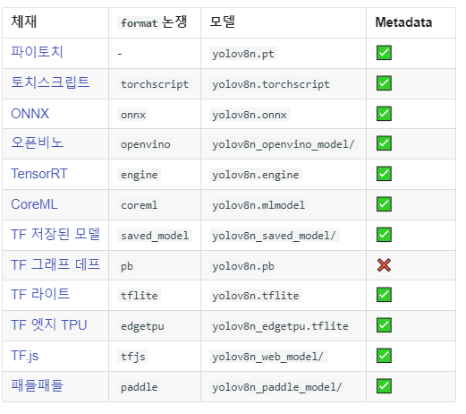

참조 사이트 <https://docs.ultralytics.com/> 

다른 것과 마찬가지로(파이참) 먼저 가상환경 만들고, 파이토치 설치 >> ultralytics 설치해야 gpu 사용할 수 있음. 

### Command Line Interface Usage

YOLO 명령줄 인터페이스(CLI)를 사용하면 Python 환경 없이 터미널에서 간단한 한 줄 명령을 사용할 수 있음.  

#### Syntax
> yolo TASK MODE ARGS
>
> Where   TASK (optional) is one of [detect, segment, classify]
>        MODE (required) is one of [train, val, predict, export, track]
>        ARGS (optional) are any number of custom 'arg=value' pairs like 'imgsz=320' that override defaults.
- TASK(선택 사항) 중 하나입니다 [detect, segment, classify]. 명시적으로 전달되지 않으면 YOLOv8은 TASK모델 유형에서 추측을 시도합니다.
- MODE(필수)는 다음 중 하나입니다.[train, val, predict, export, track]
- ARGS(선택 사항) 기본값을 재정의하는 것과 arg=value같은 임의의 수의 사용자 지정 쌍 입니다 imgsz=320. 사용 가능한 전체 목록은 구성 페이지 및 GitHub 소스를ARGS 참조하십시오.[defaults.yaml](https://github.com/ultralytics/ultralytics/blob/main/ultralytics/yolo/cfg/default.yaml)

### Detect
> yolo detect predict model=yolov8n.pt source='https://ultralytics.com/images/bus.jpg'

커스텀 모델로 예측
> yolo detect predict model=path/to/best.pt source='https://ultralytics.com/images/bus.jpg'

저장폴더는 run 이하에 Defalut "predict#'로 저장됨. 
폴더 명 변경하려면 name='폴더이름'을 추가하면 됨
> yolo detect predict model=path/to/best.pt source='https://ultralytics.com/images/bus.jpg' name=20230702-01

다양한 소스 가능함. 온라인 영상 혹은 폴더에 저장된 영상 및 이미지 등
   
   
### Export
ONNX, CoreML 등의 다른 형식으로 내보내기
> yolo export model=yolov8n.pt format=onnx

### Train
tarin 방법은 Yolov5과 유사하지만 차이 있음
> yolo detect train data=coco128.yaml model=yolov8n.pt epochs=100 imgsz=640

v5 사용 예
> python train.py --batch 20 --epoch 150 --data E:\AiProject\yolov5-ver5\datasets\team1-maskAdd3/data.yaml --weights yolov5m.pt --optimizer SGD --img 640 --hyp hyp.scratch-high.yaml --name Add3WYmB20E1
50Hyp-highOptSGD

이미 만들어진 모델에서 재개하는 방법
> yolo detect train resume model=last.pt

### Val
COCO128 데이터 세트에서 훈련된 YOLOv8n 모델 정확도를 검증   
model모델 속성으로 훈련 및 인수를 유지하므로 인수를 전달할 필요가 없음   
> yolo detect val model=yolov8n.pt

커스텀 모델일 경우
> yolo detect val model=path/to/best.pt
   
     
### 기본 인수 재정의
tarin 방법(epochs=10, learning rate=0.01)
> yolo detect train data=coco128.yaml model=yolov8n.pt epochs=10 lr0=0.01

Predict(이미지 크기 320에서 사전 학습된 분할 모델을 사용하여 YouTube 동영상을 예측)
> yolo segment predict model=yolov8n-seg.pt source='https://youtu.be/Zgi9g1ksQHc' imgsz=320

검증(배치 크기 1 및 이미지 크기 640에서 사전 학습된 감지 모델을 검증)
> yolo detect val model=yolov8n.pt data=coco128.yaml batch=1 imgsz=640

### 기본 구성 파일 재정의
...

Yolov8을 잘 활용하기 위해 공식 문서를 참조하는게 좋겠다.   

몇 번 테스트 하는데, 가장 기본적인 예제 트레인하는 과정에 DATASET을 Yolov5 폴더의 것을 이용하는 문제를 확인했다. 
내가 V8설치를 잘 못 한건가? 
이건 더 확인해 봐야 겠다.

